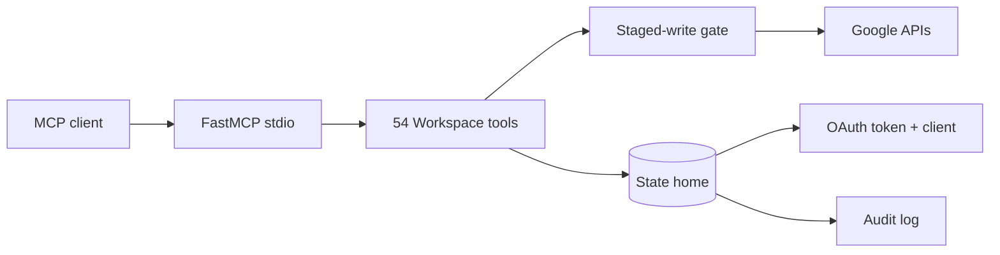

<p align="center">
  
  <br />
  <strong>Full-context Google Workspace tools for MCP clients, with staged writes.</strong>
</p>

<p align="center">
  
  
</p>

<p align="center">
  &nbsp;&nbsp;
  &nbsp;&nbsp;
  &nbsp;&nbsp;
  &nbsp;&nbsp;
  &nbsp;&nbsp;
  &nbsp;&nbsp;
  &nbsp;&nbsp;
  &nbsp;&nbsp;
  &nbsp;&nbsp;
  
</p>

<p align="center">
<a href="#why-this-server">Why this server</a> | <a href="#quick-start">Quick start</a> |
<a href="#tools">Tools</a> | <a href="#configuration">Configuration</a> |
<a href="#transport-and-security">Security</a> | <a href="#development">Development</a> |
<a href="#contributing">Contributing</a>
</p>

> [!NOTE]
> v2.1 changed all list tools from bare arrays to cursor envelopes
> (`items`, `next_page_token`, `has_more`). See
> [`docs/MIGRATION-v2.md`](docs/MIGRATION-v2.md). Pin the `v2.0` tag to stay
> on the old shapes.

## Why this server

Wrappers that trim API responses make agents decide on incomplete data. This
server goes the other way:

- Reads return the decision-useful resource, with a `full=True` hatch to the
  complete payload where one exists
- Cursor envelopes (`items`, `next_page_token`, `has_more`) on all 11 list
  tools, so collections of any size are walkable
- Every mutation is staged first: preview plus checks plus `operation_id`,
  then a single-use commit that revalidates, or a cancel
- One env var (`GOOGLE_WORKSPACE_HOME`) points at all state, so any stdio
  MCP host can run it

No tools were removed in v2.1. Ten list shapes changed; see the migration
guide.

## What it does

Eleven Google Workspace services behind one server:

- Gmail search, reads, thread summaries, attachment downloads, staged sends
- Drive search, metadata, downloads, uploads, folders, sharing audit, copy,
  move, trash
- Docs reads (all tabs), creates, appends
- Sheets metadata, reads, updates, appends, creates, conditional-format reads
- Slides reads and creates
- Forms definitions, responses, listings
- Calendar events, patches, deletes, free/busy
- Contacts lists, search, single reads
- Tasks lists, reads, creates, patches, deletes
- Chat spaces, messages, members, staged sends
- Meet spaces, reads, staged creates

## Architecture



## Quick start

### Requirements

- Python 3.11
- A Google Cloud project with the 11 Workspace APIs enabled and a Desktop
  OAuth client (see `docs/SKILL.md` for the click path)
- An MCP client that can launch stdio

### Windows PowerShell

```powershell
git clone https://github.com/cikeyz/google-workspace-mcp.git
Set-Location google-workspace-mcp
python -m venv .venv
.\.venv\Scripts\Activate.ps1
pip install -r requirements.txt
$env:GOOGLE_WORKSPACE_HOME = "$PWD\state"
python setup/setup.py --client-secret C:\path\to\client_secret.json
python setup/setup.py --auth-url
```

Open the printed URL, approve all scopes, then exchange the redirect:

```powershell
python setup/setup.py --auth-code '<paste-the-redirect-url>'
python setup/tests/verify_server.py
```

Expect `RESULT: ALL CHECKS PASSED`.

### macOS or Linux

```bash
git clone https://github.com/cikeyz/google-workspace-mcp.git
cd google-workspace-mcp
python3.11 -m venv .venv
source .venv/bin/activate
pip install -r requirements.txt
export GOOGLE_WORKSPACE_HOME="$PWD/state"
python setup/setup.py --client-secret /path/to/client_secret.json
python setup/setup.py --auth-url
python setup/setup.py --auth-code '<paste-the-redirect-url>'
python setup/tests/verify_server.py
```

Testing-mode OAuth clients need weekly re-consent unless the app is verified.

## MCP client configuration

```json
{
  "mcpServers": {
    "Google Workspace": {
      "command": "C:\\path\\to\\.venv\\Scripts\\python.exe",
      "args": ["C:\\path\\to\\server.py"],
      "env": {
        "GOOGLE_WORKSPACE_HOME": "C:\\path\\to\\state"
      }
    }
  }
}
```

## Tools

| Tool family | Purpose | Key inputs |
|---|---|---|
| `google_gmail_search`, `google_gmail_get`, `google_gmail_thread_get` | Search, read, thread summaries | `query`, `max_results`, `page_token`, `full`, `max_body_chars` |
| `google_gmail_attachment_download` | Save attachments locally | `message_id`, `attachment_id` |
| `google_gmail_send` (staged) | Send mail | `to`, `subject`, `body`, `cc`, `bcc` |
| `google_drive_search`, `google_drive_get` | Find and describe files | `query`, `max_results`, `page_token`, `full` |
| `google_drive_download`, `google_drive_upload` (staged) | Fetch and store files | `file_id`, `export_mime`, `local_path` |
| `google_drive_create_folder`, `google_drive_copy`, `google_drive_update` (staged) | Organize | `name`, `parent_folder_id` |
| `google_drive_share`, `google_drive_permissions` | Share and audit sharing | `file_id`, `email`, `role` |
| `google_drive_trash` (staged) | Recoverable delete | `file_id` |
| `google_docs_read`, `google_docs_create`, `google_docs_append` (staged) | Read and write docs | `document_id`, `title`, `text` |
| `google_sheets_metadata`, `google_sheets_read` | Inspect and read sheets | `spreadsheet_id`, `range_`, render options |
| `google_sheets_update`, `google_sheets_append`, `google_sheets_create` (staged) | Write cells | `spreadsheet_id`, `range_`, `values` |
| `google_sheets_conditional_formats` | Read format rules | `spreadsheet_id` |
| `google_slides_get`, `google_slides_create` (staged) | Read and create decks | `presentation_id`, `title` |
| `google_forms_list`, `google_forms_get`, `google_forms_responses` | Forms and answers | `form_id`, `page_token`, `filter_` |
| `google_calendar_list`, `google_calendar_get` | Events | `start`, `end`, `page_token`, `q` |
| `google_calendar_create`, `google_calendar_patch`, `google_calendar_delete` (staged) | Manage events | `summary`, `start`, `end`, `event_id` |
| `google_calendar_freebusy` | Availability windows | `time_min`, `time_max` |
| `google_people_contacts`, `google_people_search`, `google_people_get` | Contacts | `max_results`, `page_token`, `query`, `full` |
| `google_tasks_lists`, `google_tasks_list`, `google_tasks_get` | Read tasks | `tasklist_id`, `page_token`, filters |
| `google_tasks_create`, `google_tasks_update`, `google_tasks_delete` (staged) | Manage tasks | `title`, `status`, `due` |
| `google_chat_spaces`, `google_chat_messages`, `google_chat_members` | Rooms and history | `space_name`, `page_token` |
| `google_chat_send` (staged) | Post messages | `space_name`, `text`, `thread_key` |
| `google_meet_create_space` (staged), `google_meet_get_space` | Meetings | `config`, `space_name` |
| `google_auth_status` | Auth health | none |
| `google_write_commit`, `google_write_cancel`, `google_write_list_staged` | Apply staged writes | `operation_id` |

## Staged-write example

Writes never apply directly. Stage, review, then commit:

```json
{ "tool": "google_docs_create", "title": "GW-TEST-doc" }
```

returns `{ "staged": true, "operation_id": "…", "preview": {…} }`, then:

```json
{ "tool": "google_write_commit", "operation_id": "…" }
```

Commits revalidate first and refuse on drift. Cancels and failures are logged
alongside commits in `logs/google-write-audit.jsonl`.

## Pagination

```python
page = gmail_search("is:unread", 10)
msgs = page["items"]
while page["has_more"]:
    page = gmail_search("is:unread", 10, page_token=page["next_page_token"])
    msgs += page["items"]
```

Empty results are `{"items": [], "has_more": false}`, never an error.

## Configuration

| Variable | Default | Purpose |
|---|---:|---|
| `GOOGLE_WORKSPACE_HOME` | `<server dir>/state` | State home: token, client secret, downloads, audit log |
| `GOOGLE_TOKEN_PATH` | `<state>/google_token.json` | OAuth token override |
| `GOOGLE_CLIENT_SECRET_PATH` | `<state>/google_client_secret.json` | OAuth client override |
| `GOOGLE_DOWNLOAD_DIR` | `<state>/downloads/google` | Download target |
| `GOOGLE_REDIRECT_URI` | `http://localhost:1` | OAuth redirect override |
| `GW_FIXTURE_DOC_ID` | Empty | Test fixture: readable Doc |
| `GW_FIXTURE_FORM_ID` | Empty | Test fixture: readable Form |
| `GW_FIXTURE_RANGE` | `A1:B2` | Test fixture: sheet range |

## Transport and security

Stdio only. No listening ports, no network surface beyond Google's own APIs.

- `state/` holds a Gmail-capable OAuth grant. Keep the directory
  user-private and never commit it (already in `.gitignore`).
- Staged writes expire after 24h, cap at 20 concurrent, and fail closed in
  cron sessions.
- The audit log records write metadata with bodies redacted to counts and
  hashes. Treat it as sensitive.
- Testing-mode OAuth clients need weekly re-consent unless verified.

## Development

```powershell
$env:GOOGLE_WORKSPACE_HOME = "$PWD\state"
.\.venv\Scripts\python.exe setup\tests\verify_server.py
.\.venv\Scripts\python.exe setup\tests\test_server.py
```

`verify_server.py` is the quick battery (no writes). `test_server.py` runs
full stage-commit-verify-cleanup cycles across services and must finish with
`RESULT: ALL CHECKS PASSED` and zero `GW-TEST-` residue. Set
`GW_FIXTURE_DOC_ID` and `GW_FIXTURE_FORM_ID` for full coverage; fixture checks
skip otherwise.

## Upstream and license

- Repository:
  [`cikeyz/google-workspace-mcp`](https://github.com/cikeyz/google-workspace-mcp)
- Original project: written from scratch for personal agent use, no upstream.

Released under the [MIT License](LICENSE).

## Contributing

1. Fork the project
2. Create your feature branch (`git checkout -b feature/my-change`)
3. Commit your changes (`git commit -m 'Add my change'`)
4. Push to the branch (`git push origin feature/my-change`)
5. Open a Pull Request

Reads are free to add. Anything mutating must fit the staged-write protocol
(stage, preview, single-use commit) and land in both test batteries.

## Star History

<picture>
  <source
    media="(prefers-color-scheme: dark)"
    srcset="
      https://api.star-history.com/svg?repos=cikeyz/google-workspace-mcp&type=Date&theme=dark
    "
  />
  <source
    media="(prefers-color-scheme: light)"
    srcset="
      https://api.star-history.com/svg?repos=cikeyz/google-workspace-mcp&type=Date
    "
  />
  
</picture>

---

<p align="center">
  Made for agents that read everything before they act.
</p>
